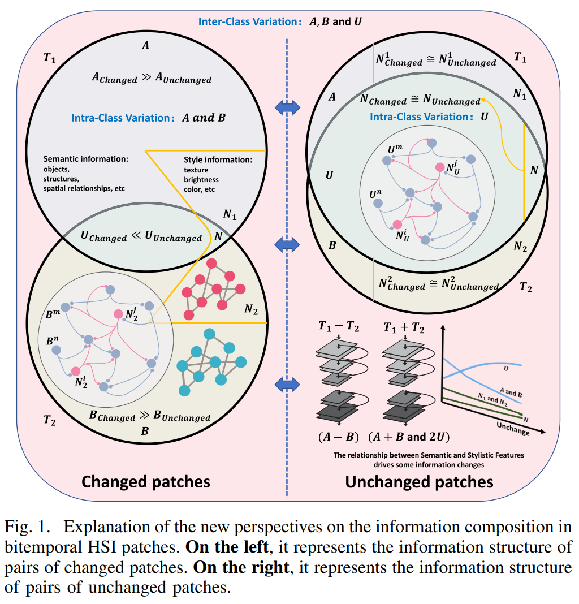
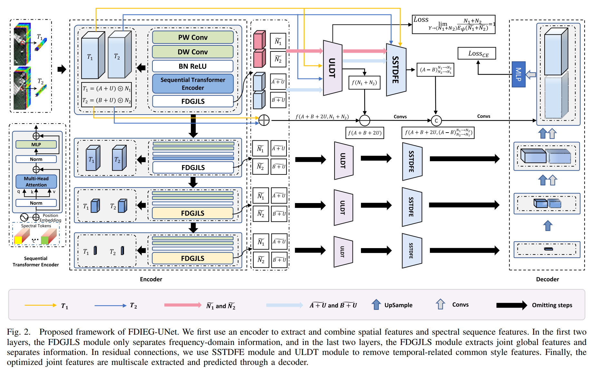
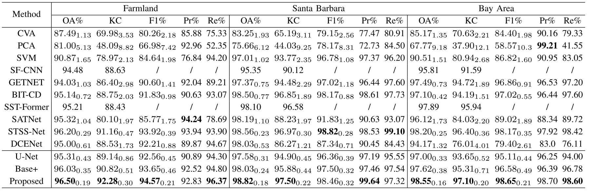
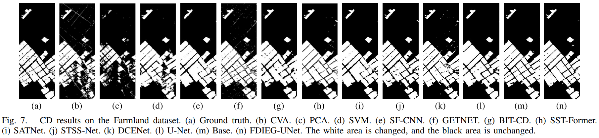
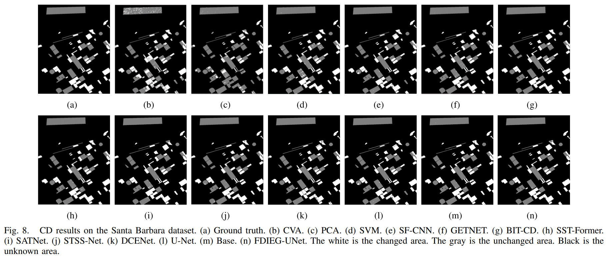
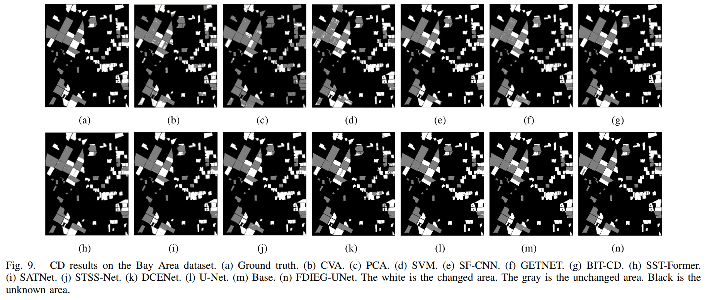

# 论文题目：Misaligned Visible-Thermal Object Detection: A Drone-based Benchmark and Baseline
* 论文地址：https://ieeexplore.ieee.org/abstract/document/10599505
* 项目地址：https://github.com/WUTCM-Lab/FDIEG-UNet

## 摘要
高光谱图像变化检测是一项同时利用光谱与空间特征以更有效检测变化的任务。不同时间获取的HSI特征往往更易受到外部因素的影响，这种扰动对于变化检测并无助益。现有方法通常将其与有效信息一同学习，并未关注“变化”与“未变化”类别的样本对是否具有相同的信息组成，也缺乏对信息对组成进行基础分析与优化，从而导致对变化样本识别效果不足以及特征融合效果差等问题。为了解决上述问题，本文重新思考了HSI-CD中双时相样本对的信息组成，提出了一种具备孪生U形结构的频域信息交换与生成网络（FDIEG-UNet）。本文贡献包括：设计了FDGJLS模块，用于学习和分离全局联合的光谱-空间特征，为后续特征域优化提供更好的频域基础信息；基于提供的信息，构建了ULDT和SSTDFE模块，以去除特征融合中由于时间相关而带来的无效风格信息，这两个模块共同作用提升变化与未变化样本间特征描述的平衡性；在三个真实HSI-CD数据集上的实验结果验证了本文方法在解决上述问题上的有效性。

## Part.01 研究贡献

1. 如图1，本文提出了一种新的思路来解释双时相高光谱图像的信息组成。在此基础上，我们提出了一种具备**孪生U形结构的频域信息交换与生成网络(FDIEG-UNet)**，用于构建最优的全局联合光谱-空间特征域，以提升高光谱变化检测的性能。
2. 本文设计了**频域全局联合学习与分离模块(FDGJLS)**，能够同时实现全局特征学习与联合特征学习，并以此作为信息分离的基础，为后续时间相关的无效风格特征去除提供基本信息支持。
3. 本文设计了**无监督可学习域转换模块(ULDT)**，用于将获取到的双时相无效风格信息从频域转换到特征域，从而实现从源头上的去除目标。这一模块提供了首个纯语义特征融合方法。
4. 本文设计了**语义-风格变换差异特征提取器(SSTDFE)**，用于提取与时间相关的语义差异特征。该模块提供了第二种纯语义特征融合方法，通过差异信息优化变化样本的识别能力。上述两个模块协同工作，有效提升了变化检测任务中变化样本与未变化样本之间的特征描述平衡性。

## Part.02 模型结构
整个 FDIEG-UNet 的处理流程如图2所示。
1. 编码器：执行时间无关的多尺度全局联合光谱–空间特征提取，并分离相关的依赖信息；
2. 残差连接：通过本文设计的 ULDT 和 SSTDFE 模块，提取具有平衡性和显著性的时间相关语义特征；
3. 解码器：从优化后的时间相关多尺度特征子空间中进行学习与预测。

## Part.03 数据集

1. [Farmland 数据集](https://rslab.ut.ac.ir/data)：该数据集中的双时相高光谱图像分别采集于2006年和2007年。每幅图像的尺寸为420 × 140像素，覆盖了中国江苏省盐城市部分耕地的变化区域。经过预处理后，图像共包含155个光谱波段。该数据集中包含40,417个未变化像素样本和18,383个变化像素样本。

2. [Santa Barbara 数据集](https://citius.usc.es/investigacion/datasets/hyperspectral-change-detection-dataset)：我们使用的 Santa Barbara 数据集中的双时相高光谱图像分别由 AVIRIS 传感器于2013年和2014年采集，用于捕捉美国加利福尼亚州圣塔芭芭拉地区的局部变化区域。每幅高光谱图像尺寸为984 × 740像素，其中包含80,418个未变化像素样本、52,134个变化像素样本，以及595,608个状态未知的像素样本。经过预处理后，该数据集的图像共包含255个光谱波段。

3. [Bay Area 数据集](https://citius.usc.es/investigacion/datasets/hyperspectral-change-detection-dataset)：该数据集中的双时相高光谱图像同样由 AVIRIS 传感器于2013年和2014年采集，用于捕捉美国加利福尼亚州帕特森地区的变化像素。每幅高光谱图像尺寸为600 × 500像素，包含34,211个未变化像素样本、38,425个变化像素样本，以及227,364个状态未知的像素样本。经过预处理后，图像共包含255个光谱波段。

## Part.04 实验结果
### 定量实验
在相同设置下，在三个数据集上与其他方法进行了比较。然而，由于部分论文未公开代码和参数，因此本文未对这些方法的相关指标进行分析。我们仅保留了一些具有可比性的对比方法。如表1所示，这些结果证明了本文的检测方法的有效性。
#### 
表1 不同方法在DVTOD数据集上的性能比较

### 定性实验
图 7 至图 9 分别展示了这三个数据集的变化检测可视化对比结果。

## Part.05 研究展望
在本文中，我们基于提出的双时相信息对比组成方法，设计了一种名为 FDIEG-UNet 的网络结构。在 FDIEG-UNet 中，我们利用 FDGJLS 模块进行全局与联合特征学习及信息分离，作为信息提供器；随后，采用 SSTDFE 模块与 ULDT 模块在频域中对信息进行处理，以优化特征域中的表示。值得指出的是，我们的方法不仅在小规模训练数据集上达到了先进的性能，同时也提升了对变化样本的分类效果。然而，该方法也存在一些不足。由于过于关注语义信息，导致部分空间细节信息丢失，难以还原至像素级别。在实验的可视化结果中可以看出，对于边缘和微小变化区域的检测效果仍不理想。未来的研究中，我们将通过引入原始像素空间中的细粒度信息来进一步解决这些问题。
